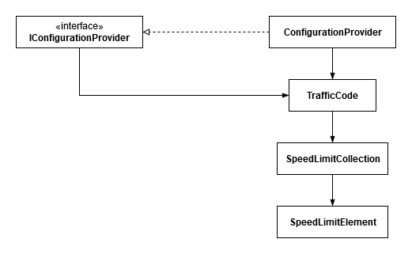
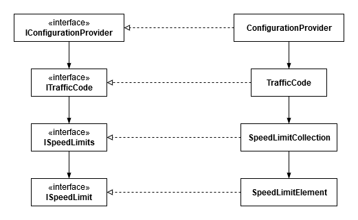

# Loose coupling to test easier

Tight coupling is a situation where a component has a lot of knowledge of other separate components. It usually implies that it depends on too much details of other components.

A situation like that could really complicate creating unit tests. It could be really hard to create an instance of a tightly-coupled component in a test code. It might be necessary to create objects of several different classes that communicate with the database, read files or perform web requests in order to create a test class. Mocking concrete classes can be much more difficult or even impossible. It might require a lot of setup and boilerplate code and could be unreliable (e.g. because the web server is currently unavailable). Some corner-case or exceptional scenarios might be impossible to test.

Such a situation is probably not very often seen while creating a new code, especially while using TDD approach. It is much more common in a legacy code.

Let's consider a situation when for some reason there is a need to introduce tests. That may be caused by a reported bug, a change request or just because of a need to cover the existing code with the tests. When a class to be tested is tightly coupled with other classes it could be a real nightmare to resolve the dependencies.

## Current state of the system

Our system needs an information about speed limits in several countries. It is contained in the configuration file.

```xml
<?xml version="1.0" encoding="utf-8"?>
<configuration>
  <configSections>
    <section name="trafficCode" type="FleetManagement.Configuration.TrafficCode, FleetManagement" />
  </configSections>
  <trafficCode>
    <speedLimits>
      <country name="Poland" limit="90" unit="Kmh" />
      <country name="UK" limit="60" unit="Mph" />
    </speedLimits>
  </trafficCode>
</configuration>
```

All that data is being exposed via a configuration provider.

```c#
public interface IConfigurationProvider
{
    TrafficCode TrafficCode { get; }
}

public class ConfigurationProvider : IConfigurationProvider
{
    public TrafficCode TrafficCode
    {
        get
        {
            return ConfigurationManager.GetSection("trafficCode") as TrafficCode;
        }
    }
}

public class TrafficCode : ConfigurationSection
{
    private const string SpeedLimitsPropertyName = "speedLimits";

    [ConfigurationProperty(SpeedLimitsPropertyName)]
    public SpeedLimitCollection SpeedLimits
    {
        get
        {
            return (SpeedLimitCollection)base[SpeedLimitsPropertyName];
        }
    }
}

[ConfigurationCollection(typeof(SpeedLimitElement), AddItemName = "country")]
public class SpeedLimitCollection : ConfigurationElementCollection
{
    private const string PropertyName = "country";

    public new SpeedLimitElement this[string countryName]
    {
        get { return (SpeedLimitElement)BaseGet(countryName); }
    }

    protected override object GetElementKey(ConfigurationElement element)
    {
        return ((SpeedLimitElement)element).CountryName;
    }

    protected override string ElementName
    {
        get { return PropertyName; }
    }

    protected override bool IsElementName(string elementName)
    {
        return PropertyName.Equals(elementName, StringComparison.OrdinalIgnoreCase);
    }

    public override bool IsReadOnly()
    {
        return false;
    }

    protected override ConfigurationElement CreateNewElement()
    {
        return new SpeedLimitElement();
    }
}

public class SpeedLimitElement : ConfigurationElement
{
    private const string NamePropertyName = "name";
    private const string LimitPropertyName = "limit";
    private const string UnitPropertyName = "unit";

    [ConfigurationProperty(NamePropertyName, IsRequired = true, IsKey = true)]
    public string CountryName
    {
        get { return (string)base[NamePropertyName]; }
    }

    [ConfigurationProperty(LimitPropertyName, IsRequired = true)]
    public int Limit
    {
        get { return (int)base[LimitPropertyName]; }
    }

    [ConfigurationProperty(UnitPropertyName, IsRequired = true)]
    public SpeedUnit Unit
    {
        get { return (SpeedUnit)base[UnitPropertyName]; }
    }
}

public enum SpeedUnit
{
    Undefined,
    Kmh,
    Mph,
}
```

The below diagram presents the current state of the system:



## A need for change

Let's imagine a request was made to implement changes in the system. It is required to create a traffic ticket calculator for a driver driving at certain speed. It would be a good idea to start with the tests.

The first step to do would be to create a new TicketCalculator class and a test class for it. The calculator would need a configuration provider for sure. It would be much more useful to provide a mock instead of a real provider. That would allow to both avoid providing an app.config file with specific values and create specific conditions for the tests (e.g. to check the boundary values).

Unfortunately, current implementation does not allow that. It is required to provide a real instance of a TrafficCode class and it doesn't allow to set SpeedLimits value. The values would need to be changed in app.config file or in some other way while the tests run. Both of these options seem disappointing to be honest.

## Dependency inversion

What is dependency inversion? It's the last (but definitely not least) of the SOLID principles. It's the rule that says that abstractions should not depend on implementation. It should be the other way around - the implementation should depend on abstractions.
Why is it important in the previously described case? There is a configuration provider hidden by an abstraction (interface) that depends on a concrete class - TrafficCode. The idea is to fix that violation and loose coupling by introducing an abstraction for TrafficCode. This way it would be possible to provide a valid mock for that part.
The first thing to do would be to add an empty ITrafficCode interface and make TrafficCode class to implement it.
Now it is possible to make the abstraction (IConfigurationProvider) depend on the other abstraction - the newly created ITrafficCode. Now it would be a good idea to use a compiler support. This change breaks the existing code as it is not building anymore because of lack of SpeedLimits property in ITrafficCode. This is why the refactor should go on. The member should be pulled up to make it an interface member. The rebuild should now succeed and it would be possible to run the tests. That was quite an easy refactor.
It is now possible to create a mock for TrafficCode. But all that work has just moved the original problem one step further. It is now ITrafficCode that depends on an implementation. The previous steps should be repeated - for SpeedLimitCollection now.
Create an empty interface, use that interface in ITrafficCode, pull the required members up. Rebuild, run tests. The tests fail and to fix them it is required to use the concrete class as a property type instead of an interface. This can be fixed by creating a private property with a concrete configuration type wrapped by a public property which is required by an interface implementation. Nevertheless, another coupling loosed a bit.
And once again the steps need to be replied for ISpeedLimits interface to get rid of dependency on concrete SpeedLimitElement class.

Now the mocks can be created freely and any conditions can be set up in tests effortlessly. Fixing the dependency inversion rule violations has helped to loose coupling and to provide an architecture that is easier to test. It also allows for more flexibility now as configuration does not need to be read from app.config file and may be e.g. downloaded from a web service by providing a new implementation of the interfaces only. Such a change should also be transparent to the clients using the configuration provider.

The below diagram presents the state of the system after the refactor:



## Last final word

On the code provided with the article on GitHub, please take a special look at FleetManagement.Tests.csproj lines 20-24 (https://github.com/brodny/articles/blob/dependency_inversion_in_tests/dependency_inversion_in_tests/example/FleetManagement.Tests/FleetManagement.Tests.csproj#L20). It needed a workaround for building process to ensure that app.config file gets copied into the build folder so it can be accessible when executing the tests. This is an additional dependency that was resolved in the process of refactoring - currently unit testing all the classes provided does not need a real .config file. It is sufficient to just configure the mocks.
